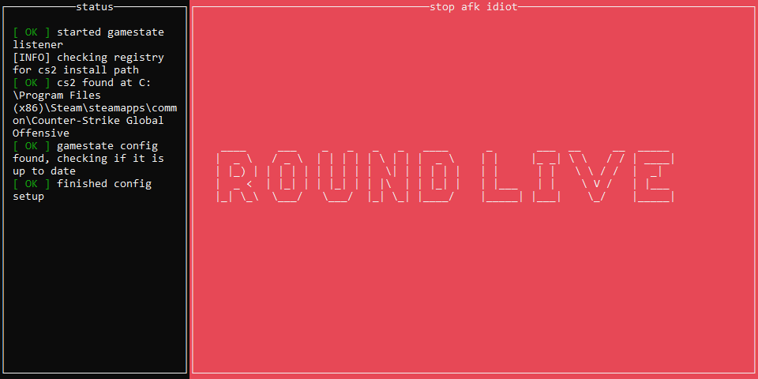

# stop-afk

Prevents people that love to tab out during CS2 games to miss the beginning of a new round.
Simply run the executable, the application should find the local CS2 instance and create a config that sets up the
Game State integration.

VAC safe as it reads round phases via [official API](https://developer.valvesoftware.com/wiki/Counter-Strike:_Global_Offensive_Game_State_Integration).